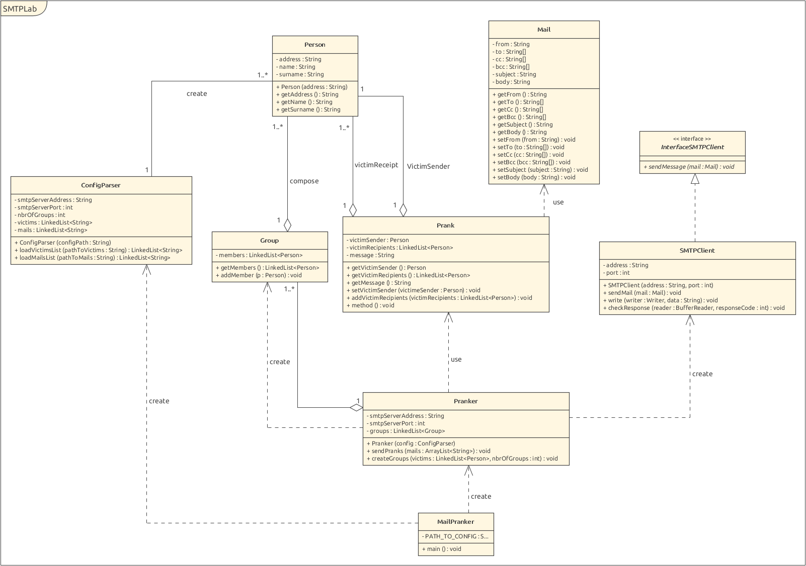

# RES - Labo SMTP

_Wachter Luc, Alves Claude-André_

## Description
This application was developed as an assignment for the RES (network programming) course at HEIG-VD.
It consists in a TCP client application in java, with the ability to send mails through TCP with the
SMTP protocol (we implemented only a small portion of the protocol). The application uses the Socket
API to communicate with a given SMTP server.

The functionality is as follows: the user fills in a list of victim email addresses and a list of
prank email messages. He can then launch the application to send these pranks to the list of victims.
Groups of victims are formed automatically, with one being the sender and the rest being recipients.

## Setting up a Mock server
If you want to test the application before using it to send actual pranks, you can use a mock SMTP server.
A mock server is a server that you can run on your machine or in a container, so that your tests can be
performed in an environment that you control.

In our example, we use a mock server instead of gmail or another mail service, because we could be
blacklisted by those services after sending so many mails in so little time, or because we made an error
while formatting our mails.

The one we used for our tests is [MockMock](https://github.com/tweakers/MockMock). Here is how you can set
up MockMock in a Docker container:

1. Build MockMock and get the `jar` file (you can also just get the jar they provide in their `release` folder).
2. Copy the `jar` file in this repo's `docker` folder, and rename it `MockMock.jar`.
3. Go into the `docker` folder (`cd docker`).
3. Write the docker command `docker build --tag smtp-mock-server .` to create a new docker image.
4. If all went well, you can see the new image in your list of images `docker images`.
5. Launch the container using `docker run smtp-mock-server`.
6. Get the IP address of your container (for example with `docker inspect <name-of-container> | grep IPAddress`).
7. Open your browser and write this IP address followed by `:8282` to specify the port.
8. Set the `smtpServerAddress` in your `config.properties` to this IP address and the port to 25.
9. Test the application without any danger to piss off someone or some ISP.

## Quick start
To use this application from the sources, here are the steps required:

1. Build the app with apache maven `mvn package`.
2. Copy the `jar` file to the location of your choice `cp target/RES_labo-SMTP-1.0-SNAPSHOT-jar-with-dependencies.jar myfolder/RES-SMTP.jar`.
3. Write a list of victim email addresses (preferably with `name.surname@domain.tld`) like the following:

    ```
    john.doe@acme.com
    vlad.putin@gov.rus
    jojo.adventure@weeb.jpp
    ```

4. You must have at least three victims for the application to function. Indeed the victims are separated in randomly selected groups of three or more.
5. Write a list of prank messages in a similar fashion (with mail subjects on the first line), but separated by `==`:

    ```
    The Room
    Oh, hi Mark.
    ==
    Google
    Hello,
    This is Google Assistant writing.
    May I ask you a few questions? Don't worry, nothing too personal!
    See you everywhere!
    ```

6. Write a main config file, with the name `config.properties` like the following:

    ```
    smtpServerAddress=172.17.0.2
    smtpServerPort=25
    numberOfGroups=2
    pathToVictims=path/to/victims.utf8
    pathToMails=path/to/mails.utf8
    ```

7. Time to prank! Launch the application by providing a path to your main config file:

    ```
    java -jar RES-SMTP.jar path/to/config.properties
    ```

## Implementation choices
Our design is heavily inspired by the one shown by our professor in [this video](https://www.youtube.com/watch?v=OrSdRCt_6YQ). We have the same class hierarchy for the most part, as you can see in the following diagram.


